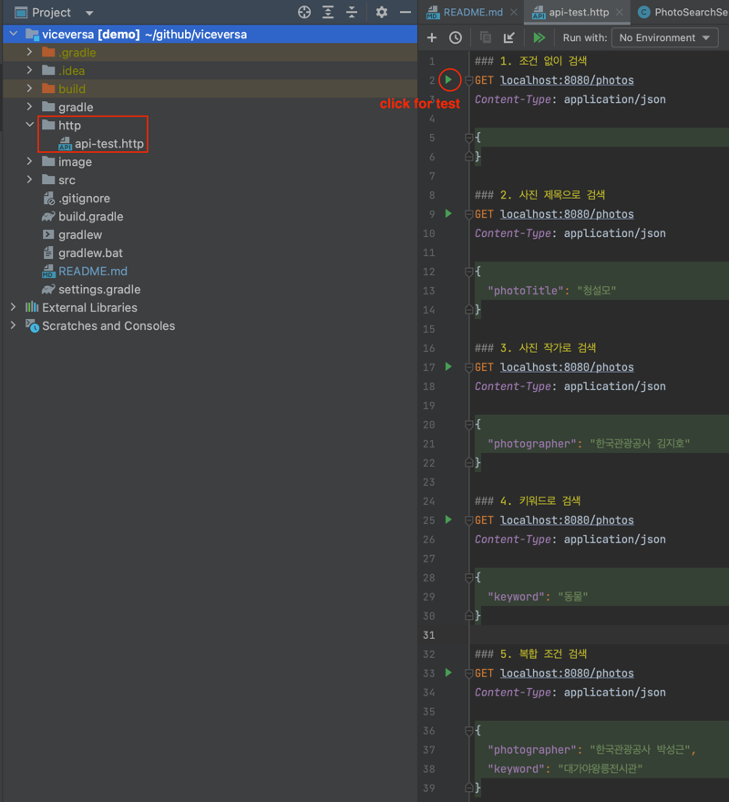
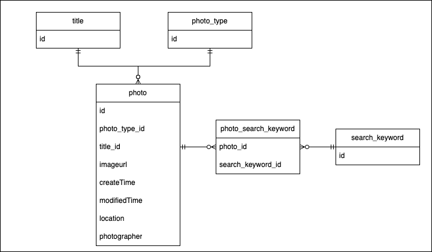
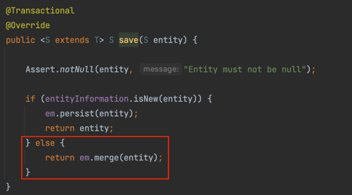
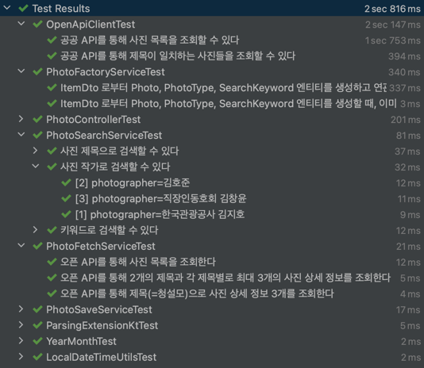

# viceversa 사전 과제

---

## 📝 기능 구현 목록

- [x] 공공 API를 이용하여 원하는 개수만큼 제목 목록을 조회할 수 있다.
- [x] 공공 API를 이용하여 원하는 개수만큼 제목별 사진을 조회할 수 있다.
- [x] 공공 API를 이용하여 원하는 개수만큼 제목 목록을 조회하고, 제목별 사진들을 데이터베이스에 저장할 수 있다.
- [x] 공공 API 호출 결과를 파싱하여 Photo 객체를 생성할 수 있다.
- [x] 연도, 월, 시간을 표현하는 문자열로부터 LocalDateTime 객체를 생성할 수 있다.
- [x] YearMonth 객체는 연도,월 정보를 표현한다.
- [x] 제목, 키워드, 사진작가를 조건으로 사진을 검색할 수 있다.

<br/>

## 🏃 실행 방법

1. src/main/resources/application.yml 확인 및 조정

- titleFetchCount x defailFetchCount = 공공데이터포털로부터 패칭할 데이터 수
- openapi.fetch.disable: 애플리케이션 시작시 공공데이터포털로부터 데이터 패칭을 정지

```yaml
openapi:
  secretKey: xxxx
  dataType: json
  timeout: 10
  fetch:
    disable: false
    titleFetchCount: 10
    detailFetchCount: 50
```

2. 애플리케이션 실행

- 방법1) Intellij Run 버튼 클릭 (⭐ 추천)
- 방법2) 터미널에서 다음 순서대로 입력
  1. `$ ./gradlew build`
  2. `$ java -jar build/libs/demo.jar`

3. API 실행
- 방법1) http/api-test.http 실행 (⭐ 추천)
- 방법2) 포스트맨을 통해 API 테스트



<br/>

## 🤔 주요 문제 해결 과정

### 도메인 설계

- 데이터가 반복되는 것들은 별도의 엔티티로 구성하여 데이터 중복을 최소화
- 공공데이터포털의 Item 데이터를 Photo 엔티티 하나로 표현
- photo ↔︎ search_keyword 관계(다대다)를 일대다, 다대일 관계로 풀어서 설계



### 데이터 파싱 예외 처리

- 데이터 관찰 결과, 다음과 같은 예외 상황을 발견
- `galSearchKeyword: "Fit, Fit"` 과 같이 중복된 키워드가 두 번 이상 등장하는 경우, JPA duplicate Key 발생하지 않도록 중복 제거 처리
- `galPhotographyMonth: 20200` 과 같이 값이 무효한 경우 null 값으로 파싱

### 외부 API 통신 인터페이스 결정에 대한 고민

- Spring 사용시, 외부 API 통신을 위한 수단은 다양함
    - HttpClient
    - RestTemplate
    - WebClient
    - Http Interface Client
    - etc...
- Spring6에서 제공하는 `Http Interface Client` 선택
    - 이유1 - 인터페이스 형태로 mock 라이브러리 지원 없이 mocking 가능
    - 이유2 - 논블록킹 I/O 지원

### 외부 API 테스트 mocking

- 공공데이터포털 API 테스트를 수행하되 횟수를 최소화하고, 되도록 mocking 진행하여 테스트 속도 및 일관성 향상에 집중

### 논블록킹 I/O

- 공공데이터포털 API 호출시 시간이 굉장히 오래걸리는 문제 발생
- 네트워크 I/O 시간 단축을 위해 비동기 프로그래밍 도입 결정
- Spring5에서 지원하는 WebFlux 학습 및 적용
- 공공데이터포털 API 호출 성능 50% 이상 개선(10번 호출시, 8~12초 → 3초)

### 컬럼명과 H2 데이터베이스 예약어 충돌

- 개발 초기 PHOTO 테이블의 DDL 수행시 예외 발생
- 컬럼명을 하나씩 제거해보며 디버깅 수행
- "YEAR" 라는 컬럼명이 예약어어와 충돌한다는 사실 발견
- `auto_quote_keyword: true` 속성으로 해결

### Spring Data JPA - 이미 키가 존재하는 엔티티 저장하기

- Spring Data JPA 사용하여 엔티티 저장시 EntityNotFoundException 발생
- JpaRepository 구현체 코드를 직접 확인하여 원인 발견
    - Photo, Title, PhotoType, SearchKeyword 등의 엔티티의 키는 자동 생성되는 것이 아닌, 공공데이터포털 API 결과로부터 추출하여 할당
    - 이미 키가 존재하는 경우, SimpleJpaRepository 는 `persist()`가 아닌 `merge()` 수행
    - 데이터베이스에 엔티티가 존재하지 않기 때문에 `merge()` 수행시 예외 발생
- `Persistable.isNew()` 오버라이딩을 통해 `persist()`가 수행되도록 수정하여 문제 해결



### QueryDsl - 동적쿼리

- 쿼리 where절 조건의 파라미터 수를 다양하게 하여 검색 기능 향상
- 파라미터가 `null` 값이 들어와도, 컴파일되도록 커스텀 nullsafeBuilder 사용
- [PhotoSearchService](src/main/java/ai/viceversa/demo/service/PhotoSearchService.java) 참고

### 테스트 코드 작성

- JUnit5의 ParameterizedTest를 이용해 꼼꼼한 테스트를 위해 노력
- 도메인, 유틸리티, 서비스, 컨트롤러 등 전 범위 테스트 수행


